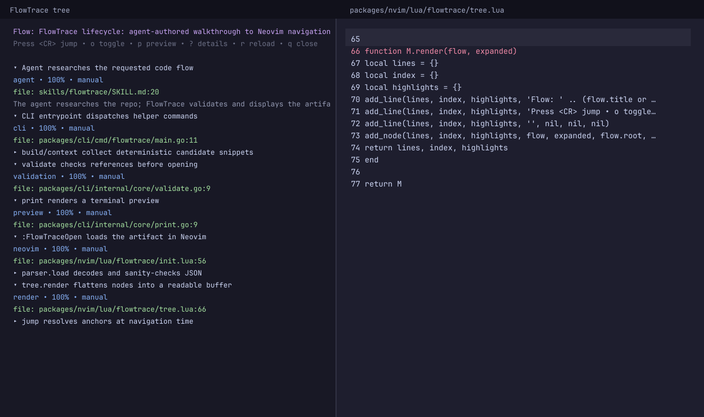
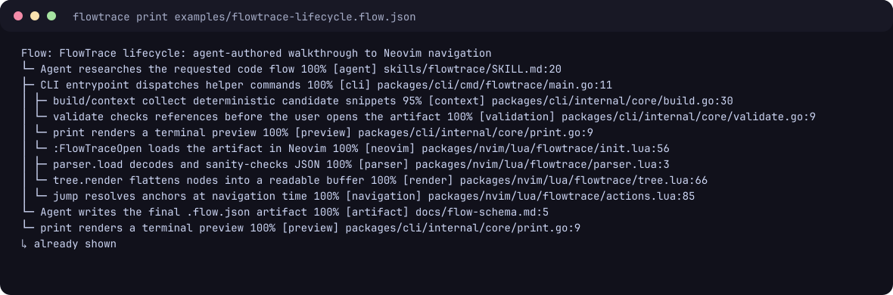

# FlowTrace

FlowTrace turns natural-language code exploration requests into validated, jumpable code walkthrough artifacts.

Instead of asking an AI agent for only a prose summary of a codebase, FlowTrace produces a `.flow.json` map of real source files, functions, branches, and data transformations. The CLI provides deterministic repository context, scaffold generation, validation, and printing; your coding agent does the research/reasoning and writes the final artifact. The Neovim plugin opens the artifact as an interactive tree you can jump through.

Status: early public MVP. The CLI intentionally does not call LLM APIs. Use it from Claude Code, Codex, Cursor, or another coding agent as a deterministic artifact tool. The Neovim plugin can be installed directly from the public GitHub repository with lazy.nvim/LazyVim.

## Screenshots

FlowTrace opens a persistent tree next to the source, with colored metadata and jumpable file anchors:



The same artifact can be inspected in the terminal before opening Neovim:



The artifact used for these screenshots is [`examples/flowtrace-lifecycle.flow.json`](examples/flowtrace-lifecycle.flow.json).

## Repository layout

```text
packages/cli/        Go CLI: build, validate, and print FlowTrace artifacts
packages/nvim/       Neovim/LazyVim plugin runtime files
skills/flowtrace/    Agent Skill package compatible with the Agent Skills spec
docs/                schema, install, development, and release notes
examples/            sample app and sample .flow.json artifact
```

## Requirements

- Go 1.22+
- Neovim 0.9+ for the plugin
- Optional: Node.js/npm only if you install the Agent Skill with `npx skills`

## Install the CLI

From the public GitHub repository:

```bash
go install github.com/ebrakke/flowtrace/packages/cli/cmd/flowtrace@latest
```

Then from any repository you want to explore:

```bash
flowtrace build --root . "walk through the main request flow"
flowtrace validate --root . .flowtrace/walk-through-the-main-request-flow.flow.json
flowtrace print .flowtrace/walk-through-the-main-request-flow.flow.json
```

Agent workflow:

- `flowtrace context "request"` prints candidate files/snippets for your coding agent.
- The agent uses its own model/context tools to decide the real flow and writes `.flowtrace/<name>.flow.json`.
- `flowtrace validate` checks paths, line ranges, references, and schema shape.
- `flowtrace print` previews the tree in a terminal.

`flowtrace build` is a deterministic search-based scaffold generator. It is useful as a starting point, but agent-authored artifacts should usually be better.

## Install the Neovim / LazyVim plugin

With LazyVim/lazy.nvim from the public GitHub repository:

```lua
-- ~/.config/nvim/lua/plugins/flowtrace.lua
return {
  {
    "ebrakke/flowtrace",
    name = "flowtrace.nvim",
    lazy = false,
    config = function(plugin)
      vim.opt.runtimepath:append(plugin.dir .. "/packages/nvim")
      vim.cmd("runtime plugin/flowtrace.lua")
    end,
  },
}
```

Why the small `config` block? The plugin lives in the monorepo subdirectory `packages/nvim`, so the spec adds that subdirectory to Neovim's runtimepath and sources the plugin file.

Commands:

```vim
:FlowTraceOpen path/to/file.flow.json
:FlowTraceLast
:FlowTraceRefresh
:FlowTraceClose
```

Default keys in the FlowTrace tree: `<CR>` jump, `o` expand/collapse, `p` preview, `?` details, `r` refresh, `q` close.

## Quick start from a clone

```bash
git clone https://github.com/ebrakke/flowtrace.git
cd flowtrace

go test ./packages/cli/...
go run ./packages/cli/cmd/flowtrace validate --root . examples/simple.flow.json
go run ./packages/cli/cmd/flowtrace print examples/simple.flow.json
```

Generate a deterministic search-only walkthrough for this repository:

```bash
go run ./packages/cli/cmd/flowtrace build \
  --root . \
  --out .flowtrace/flowtrace-build.flow.json \
  "walk through the flowtrace build command"

go run ./packages/cli/cmd/flowtrace validate --root . .flowtrace/flowtrace-build.flow.json
```

Open the artifact in Neovim after installing the plugin:

```vim
:FlowTraceOpen .flowtrace/flowtrace-build.flow.json
```

## Install the Agent Skill

The canonical skill package is `skills/flowtrace/SKILL.md`. It follows the Agent Skills spec: the folder name and `name` frontmatter are both `flowtrace`.

Install with the Skills CLI:

```bash
npx skills add https://github.com/ebrakke/flowtrace --skill flowtrace
```

Install manually for agents that scan the cross-client convention:

```bash
git clone https://github.com/ebrakke/flowtrace.git
mkdir -p ~/.agents/skills
cp -R flowtrace/skills/flowtrace ~/.agents/skills/flowtrace
```

See [`docs/agent-skill.md`](docs/agent-skill.md) for assumptions and validation notes.

## Documentation

- [`docs/installation.md`](docs/installation.md) - detailed install and usage notes
- [`docs/flow-schema.md`](docs/flow-schema.md) - `.flow.json` schema
- [`docs/agent-skill.md`](docs/agent-skill.md) - Agent Skill packaging notes
- [`docs/development.md`](docs/development.md) - contributor/development workflow
- [`docs/release.md`](docs/release.md) - MVP release checklist
- [`docs/mvp.md`](docs/mvp.md) - original technical MVP plan

## License

MIT. See [`LICENSE`](LICENSE).
