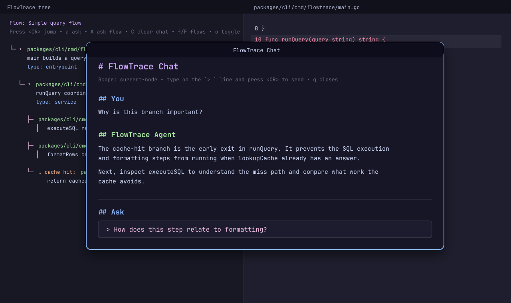

# FlowTrace

FlowTrace turns natural-language code exploration requests into validated, jumpable code walkthrough artifacts.

Instead of asking an AI agent for only a prose summary of a codebase, FlowTrace produces a `.flow.json` map of real source files, functions, branches, and data transformations. Your coding agent does the research/reasoning and writes the final artifact; the CLI provides deterministic context, validation, and terminal preview commands. The Neovim plugin opens the artifact as an interactive tree you can jump through.

Status: early public MVP. The CLI intentionally does not call LLM APIs. Use it from Claude Code, Codex, Cursor, or another coding agent as a deterministic artifact tool. The Neovim plugin can be installed directly from the public GitHub repository with lazy.nvim/LazyVim.

## Screenshots

FlowTrace opens a persistent tree next to the source, with colored metadata and jumpable file anchors:


Optional in-Neovim chat lets you ask contextual questions about the current node or whole flow without leaving the walkthrough:



The same artifact can be inspected in the terminal before opening Neovim:


The artifacts used for screenshots and demos are checked in under [`.flowtrace/`](.flowtrace/) and point at this repository's own code.

## Repository layout

```text
packages/cli/        Go CLI: context, validate, and print FlowTrace artifacts
packages/nvim/       Neovim/LazyVim plugin runtime files
skills/flowtrace/    Agent Skill package compatible with the Agent Skills spec
docs/                schema, install, development, and release notes
.flowtrace/          checked-in FlowTrace walkthroughs for this repository
```

## Requirements

- Go 1.22+
- Neovim 0.9+ for the plugin
- Optional: Node.js/npm only if you install the Agent Skill with `npx skills`

## Install the CLI

From the public GitHub repository:

```bash
go install github.com/ebrakke/flowtrace/packages/cli/cmd/flowtrace@latest
```

Then from any repository you want to explore, have your coding agent research the codebase and write `.flowtrace/<name>.flow.json`. Use the CLI to gather optional hints, validate, and preview:

```bash
flowtrace context --root . "walk through the main request flow"   # optional hints for the agent
flowtrace validate --root . .flowtrace/main-request-flow.flow.json
flowtrace print .flowtrace/main-request-flow.flow.json
```

Agent workflow:

- The agent uses its own code-reading tools to decide the real flow and writes `.flowtrace/<name>.flow.json`.
- `flowtrace context` is optional; it only prints candidate files/snippets as hints.
- `flowtrace validate` checks paths, line ranges, references, and schema shape.
- `flowtrace print` previews the tree in a terminal.

## Install the Neovim / LazyVim plugin

With LazyVim/lazy.nvim from the public GitHub repository:

```lua
-- ~/.config/nvim/lua/plugins/flowtrace.lua
return {
  {
    "ebrakke/flowtrace",
    name = "flowtrace.nvim",
    lazy = false,
    config = function(plugin)
      vim.opt.runtimepath:append(plugin.dir .. "/packages/nvim")
      vim.cmd("runtime plugin/flowtrace.lua")

      -- Optional: enable in-Neovim contextual chat via an external agent.
      require("flowtrace").setup({
        agent = {
          -- Default provider for new chat requests. Switch any time with
          -- :FlowTraceAgentProvider pi or :FlowTraceAgentProvider claude.
          provider = "pi",
          providers = {
            pi = {
              command = "pi",
              args = { "-p" },
              prompt_arg = "Answer the user's FlowTrace question using the context from stdin.",
            },
            claude = {
              command = "claude",
              args = { "-p" },
              prompt_arg = "Answer the user's FlowTrace question using the context from stdin.",
            },
          },
        },
      })

      -- Optional convenience keymaps. Uppercase <leader>F avoids LazyVim's
      -- default lowercase <leader>f file/find namespace.
      vim.keymap.set("n", "<leader>Ft", "<cmd>FlowTraceLast<CR>", { desc = "FlowTrace: open latest trace" })
      vim.keymap.set("n", "<leader>Fc", "<cmd>FlowTraceClose<CR>", { desc = "FlowTrace: close" })
      vim.keymap.set("n", "<leader>Fr", "<cmd>FlowTraceRefresh<CR>", { desc = "FlowTrace: refresh" })
      vim.keymap.set("n", "<leader>Fa", "<cmd>FlowTraceAsk<CR>", { desc = "FlowTrace: ask current node" })
      vim.keymap.set("n", "<leader>FA", "<cmd>FlowTraceAskFlow<CR>", { desc = "FlowTrace: ask whole flow" })
      vim.keymap.set("n", "<leader>Fp", "<cmd>FlowTraceAgentProvider ", { desc = "FlowTrace: switch provider" })
    end,
  },
}
```

Why the small `config` block? The plugin lives in the monorepo subdirectory `packages/nvim`, so the spec adds that subdirectory to Neovim's runtimepath and sources the plugin file.

Commands:

```vim
:FlowTraceOpen path/to/file.flow.json
:FlowTraceLast
:FlowTraceRefresh
:FlowTraceClose
:FlowTraceAsk       " open chat scoped to the current node
:FlowTraceAskFlow   " open chat scoped to the whole flow
:FlowTraceChat      " reopen the current chat window
:FlowTraceChatClear " clear the in-memory chat transcript
:FlowTraceAgentProvider [name] " show or switch chat provider
```

Default keys in the FlowTrace tree: `<CR>` jump, `a` chat about the current node, `A` chat about the whole flow, `C` clear chat, `o` expand/collapse, `p` preview, `?` details popup, `D` toggle the selected-node detail panel, `r` refresh, `q` close.

The Neovim tree defaults to compact rows: each node is one line, while the currently selected node's location, child counts, and summary stay visible in a separate detail panel below the tree. The tree and details are separate splits, so long traces can scroll without pushing the selected-node summary off-screen. You can opt out with `require("flowtrace").setup({ view = { compact = false } })` or hide the panel by default with `view = { detail_panel = false }`.

Inside the chat window, type your question on the bottom `> ` input line and press `<CR>` to send. `q` or `<Esc>` closes the floating window while preserving the transcript; `:FlowTraceChat` reopens it.

Agent chat supports multiple named external providers. Configure them under `agent.providers`, choose the default with `agent.provider`, and switch mid-session without clearing the transcript:

```vim
:FlowTraceAgentProvider        " show current provider and available providers
:FlowTraceAgentProvider pi     " use Pi for subsequent questions
:FlowTraceAgentProvider claude " use Claude for subsequent questions
```

Suggested convenience keymaps from the install snippet:

```text
<leader>Ft  open latest trace
<leader>Fc  close FlowTrace
<leader>Fr  refresh current trace
<leader>Fa  ask about current node
<leader>FA  ask about whole flow
<leader>Fp  switch chat provider
```

## Quick start from a clone

```bash
git clone https://github.com/ebrakke/flowtrace.git
cd flowtrace

go test ./packages/cli/...
go run ./packages/cli/cmd/flowtrace validate --root . .flowtrace/cli-and-nvim-paths.flow.json
go run ./packages/cli/cmd/flowtrace print .flowtrace/cli-and-nvim-paths.flow.json
```

Preview another included repository walkthrough:

```bash
go run ./packages/cli/cmd/flowtrace validate --root . .flowtrace/lua-plugin-tree-build.flow.json
go run ./packages/cli/cmd/flowtrace print .flowtrace/lua-plugin-tree-build.flow.json
```

Open the artifact in Neovim after installing the plugin:

```vim
:FlowTraceOpen .flowtrace/cli-and-nvim-paths.flow.json
```

## Install the Agent Skill

The canonical skill package is `skills/flowtrace/SKILL.md`. It follows the Agent Skills spec: the folder name and `name` frontmatter are both `flowtrace`.

Install with the Skills CLI:

```bash
npx skills add https://github.com/ebrakke/flowtrace --skill flowtrace
```

Install manually for agents that scan the cross-client convention:

```bash
git clone https://github.com/ebrakke/flowtrace.git
mkdir -p ~/.agents/skills
cp -R flowtrace/skills/flowtrace ~/.agents/skills/flowtrace
```

See [`docs/agent-skill.md`](docs/agent-skill.md) for assumptions and validation notes.

## Documentation

- [`docs/installation.md`](docs/installation.md) - detailed install and usage notes
- [`docs/flow-schema.md`](docs/flow-schema.md) - `.flow.json` schema
- [`docs/agent-skill.md`](docs/agent-skill.md) - Agent Skill packaging notes
- [`docs/development.md`](docs/development.md) - contributor/development workflow
- [`docs/release.md`](docs/release.md) - MVP release checklist
- [`docs/mvp.md`](docs/mvp.md) - original technical MVP plan

## License

MIT. See [`LICENSE`](LICENSE).
